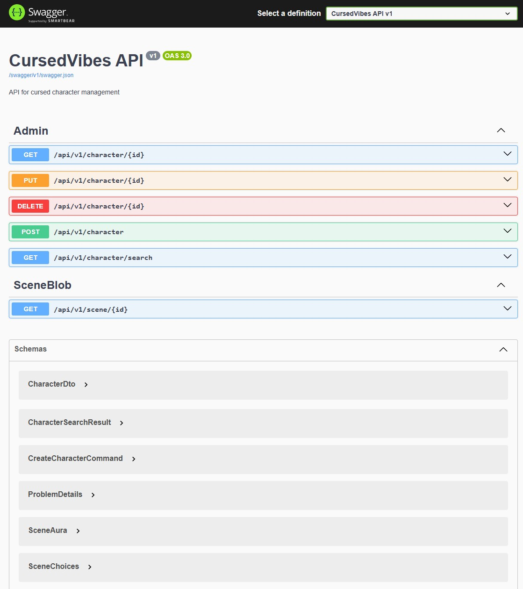

# 🕯️ CursedVibes API
The backend powering an interactive storytelling experience — mysterious, emotional, and evolving.  

Currently under development ⚙️  

---

## 🌌 Background  
**CursedVibes API** serves as the foundation for a narrative-driven game experience.  
It supports CRUD and search operations **characters** and secure **scene retrieval** from **Azure Blob Storage**. 
The project follows **Clean Architecture** principles to keep the codebase modular, maintainable, and easy to extend as the story grows.
The API powers the frontend companion, **CursedVibesRealm**, built with Next.js and TypeScript

---

## 🔧 Tech Stack  

| Technology | Purpose |
|-------------|----------|
| **ASP.NET Core WebAPI** | Robust and scalable framework for building RESTful APIs |
| **Azure App Service** | Hosts and manages the API in a scalable cloud environment |
| **Azure Blob Storage** | Secure and efficient storage for media and story scenes |
| **Azure SQL Database** | Reliable cloud-based data persistence |
| **Azure Key Vault** | Securely stores and manages secrets, keys, and connection strings |
| **Entra ID (Azure AD)** | Authentication and access control |
| **Entity Framework Core** | Simplifies database operations through ORM |
| **MediatR & CQRS** | Implements clean CQRS architecture and decoupled request handling |
| **AutoMapper** | Handles object mapping to keep code clean |
| **FluentValidation** | Provides structured and expressive validation for models |
| **xUnit & Moq** | Used for unit testing and mocking dependencies in the Application layer |
| **EF Core InMemory** | Enables lightweight integration testing of repositories in the Infrastructure layer |

---
## 🧪 API Playground (Swagger UI)
A visual overview of all available endpoints. Fully testable via Swagger for smooth development and debugging.



---
## 🚀 Getting Started  

Run the API locally:  
```bash
dotnet restore

dotnet build

dotnet run --project WebAPI

The API will be available at:
👉 https://localhost:54916/swagger
```

## 🧪 Testing
To run tests:
```bash
dotnet test
``` 

---

## 🧠 Project Goals

- Build a modular and extendable backend for interactive storytelling

- Experiment with clean architecture and CQRS patterns

- Integrate secure Azure services for a production-grade experience

---

## 🧩 Roadmap (WIP)

- [ ] Add scene creation and editing endpoints
- [ ] Implement an AI-powered chat feature to enhance interactive storytelling
- [ ] Implement authentication & role-based access
- [ ] Expand world-building entities (places, events, relationships)
- [ ] Connect with CursedVibesRealm frontend

